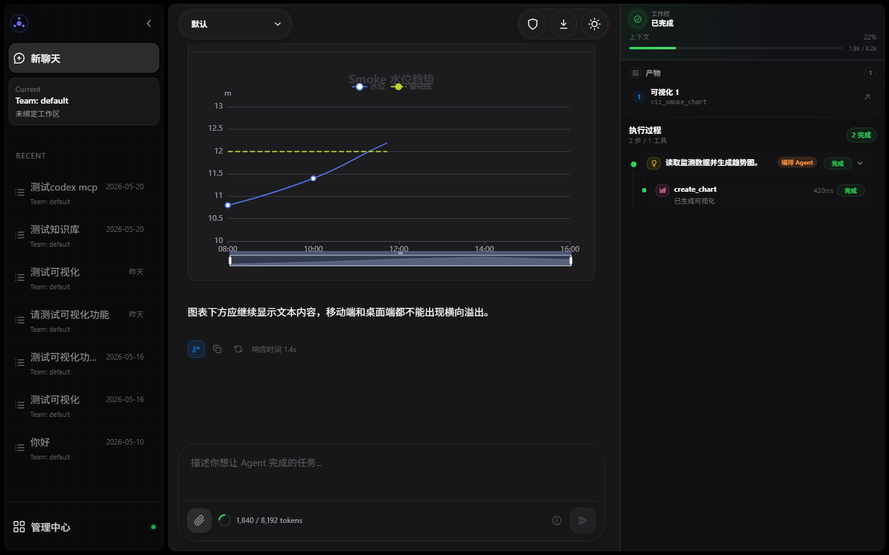
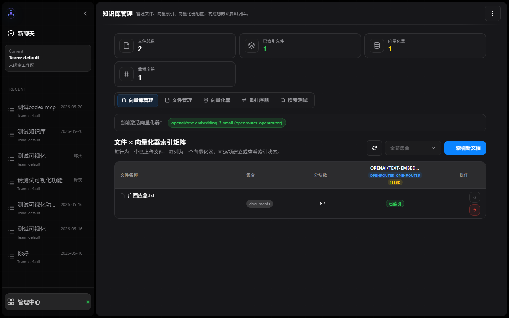

# RAGSystem

中文 | [English](#english)

RAGSystem 是一个面向多智能体协作场景的 Agent-first 全栈项目，包含 FastAPI 后端与 Vue 3 前端。仓库当前聚焦于 ReAct 编排、多 Agent 执行、Skill 化能力收敛、WebSocket 实时交互、Memory 与 Hook 系统、MCP 集成，以及面向运行时目录的配置驱动 Agent 系统。

## 核心能力 / Key features

- 多智能体编排：基于 Orchestrator Agent 的动态委派、协作与连续执行
- 子 Agent 会话：支持 child agent 创建、找回与 send_message 续接
- 实时交互：`POST /api/agent/stream` 启动任务，session WebSocket 推送消息流、执行树、审批、输入和重连回放事件
- 工具与扩展：内置工具运行时、Skills、MCP Server 集成
- 记忆与钩子：支持按需记忆召回、会话记忆写入与 Hook 事件扩展
- 配置化运行：支持 Agent Team、模型提供方、MCP 服务、向量化器与守护 Agent 的运行时配置
- 可视化前端：聊天、执行过程、Team 编排、Agent 配置、MCP 管理、知识库、模型管理、守护 Agent 与系统配置页面

前端主导航同时提供 TeamBuilder 入口（`/team-builder`），用于生成、切换与整理 Team 方案；生成后的 Team 可继续进入 Agent 配置页做细调。

## 界面预览 / Screenshots

<p align="center">
  
</p>

<p align="center">
  
  
</p>

<p align="center">
  
  
</p>

<p align="center">
  
</p>

截图由前端 smoke 截图工具生成，可通过 `cd frontend-client && npm run screenshot:smoke` 重新生成并检查关键页面。

## 仓库结构 / Repository layout

```text
.
├── backend-fastapi/          # FastAPI backend and agent runtime
├── frontend-client/          # Vue 3 client and execution visualization
├── docs/                     # Canonical documentation center
└── .github/                  # GitHub templates and workflows
```

## 技术栈 / Tech stack

- 后端 / Backend: FastAPI, Pydantic, WebSocket, EventBus, MCP, Python
- 前端 / Frontend: Vue 3, Vite, Axios, ECharts, Leaflet
- 运行模式 / Runtime: Agent-first orchestration with ReAct-style execution, Skills, Memory, Hooks, and runtime-managed local config

## 快速开始 / Quick start

### 1. 环境要求 / Prerequisites

- Python 3.12（CI 使用 / used in CI）
- Node.js 20+
- npm
- Chrome 或 Edge（仅生成截图时需要）

### 2. 环境与运行时配置 / Environment and runtime config

先复制环境变量示例：

```bash
cp backend-fastapi/.env.example backend-fastapi/.env
cp frontend-client/.env.example frontend-client/.env
```

后端启动时会把缺失的运行时配置从 `.example` 模板初始化到运行时目录，并由 `AgentConfigManager` 生成系统默认 `default` team（包含 `orchestrator_agent`、`team_maker`、`plan_agent`、`explor_agent`、`general_agent`、`review_agent`、`test_agent`）。正式生效的配置读取自运行时目录，不再直接存放在 `backend-fastapi/...` 源码目录；模型 Provider、MCP Server、向量化器和守护 Agent 配置可在前端管理页面继续编辑。

- 默认运行时数据根目录：`~/.ragsystem`
- 若设置 `RAG_DATA_ROOT`，则运行时数据根目录变为 `<RAG_DATA_ROOT>`
- 主要运行时配置文件位于 `<data-root>/config`：
  - `app/config.yaml`
  - `agents/team_index.yaml`
  - `agents/teams/*.yaml`
  - `model_adapter/providers.yaml`
  - `vector_store/vectorizers.yaml`
  - `mcp/mcp_servers.yaml`
  - `daemon/daemon.yaml`

更完整的运行、配置与验证说明见 [docs/OPERATIONS.md](docs/OPERATIONS.md)。

Windows PowerShell 可使用 `Copy-Item` 代替 `cp`。

### 3. 启动后端 / Start the backend

```bash
cd backend-fastapi
pip install -r requirements.txt
python main.py
```

默认监听 `http://localhost:5001`。可通过 `FASTAPI_HOST`、`FASTAPI_PORT`、`PORT`、`FASTAPI_RELOAD` 调整启动参数；当 `frontend-client/dist` 存在时，后端也会托管前端构建产物。

### 4. 启动前端 / Start the frontend

```bash
cd frontend-client
npm install
npm run dev
```

默认开发地址为 `http://localhost:5174`，并通过 Vite 代理 `/api` 与 WebSocket 到 `http://localhost:5001`。可在 `frontend-client/.env` 中配置 `VITE_DEV_PORT` 与 `VITE_API_PROXY_TARGET`。

### 5. 构建 Windows 安装包 / Build a Windows installer

当前仓库已提供基于 Electron 的桌面封装目录 `desktop-electron/`，用于把 Vue 前端、FastAPI 后端与 Python 打包产物组合为 Windows 安装包。

先安装桌面壳依赖：

```bash
cd desktop-electron
npm install
```

再在后端 Python 环境中安装 PyInstaller：

```bash
cd ../backend-fastapi
pip install -r requirements.txt pyinstaller
```

然后执行安装包构建：

```bash
cd ../desktop-electron
npm run build:installer
```

构建链路会依次：
- 构建 `frontend-client/dist`
- 使用 `backend-fastapi/ragsystem_backend.spec` 生成后端 exe 目录版产物（自动排除 skill 子目录中的 `.venv` 等本地虚拟环境）
- 通过 `electron-builder` 输出 NSIS 安装包到 `desktop-electron/release/`

安装后的桌面端会：
- 启动本地 FastAPI 后端
- 使用内置窗口访问 `http://127.0.0.1:5001`
- 将运行时数据写入用户主目录下的 `~/.ragsystem/`
- 以后端进程工作目录固定到该 `~/.ragsystem`，避免安装在 `Program Files` 时向只读安装目录写入运行时文件

## 测试与验证 / Testing

后端：

```bash
cd backend-fastapi
python -m compileall .
python -m py_compile main.py
pytest --basetemp=.pytest-tmp agents/tests/
```

前端：

```bash
cd frontend-client
npm run build
npm test
npm run screenshot:smoke
```

## 文档导航 / Documentation

- [docs/README.md](docs/README.md) — 仓库正式文档中心 / canonical repository documentation center
- [backend-fastapi/docs/README.md](backend-fastapi/docs/README.md) — 后端文档入口 / backend documentation entry
- [frontend-client/docs/README.md](frontend-client/docs/README.md) — 前端文档入口 / frontend documentation entry
- [docs/OPERATIONS.md](docs/OPERATIONS.md) — 运行、配置与验证 / operations, configuration, and verification
- [docs/refactor/README.md](docs/refactor/README.md) — 当前演进专题 / active evolution topics

## 贡献 / Contributing

欢迎提交 Issue 和 Pull Request。开始贡献前，请先阅读 [CONTRIBUTING.md](CONTRIBUTING.md)。

## 许可证 / License

本项目基于 [MIT License](LICENSE) 开源。

---

## English

RAGSystem is an agent-first full-stack project for multi-agent collaboration. It combines a FastAPI backend with a Vue 3 frontend, and currently focuses on ReAct-style orchestration, multi-agent execution, Skill-based capabilities, WebSocket realtime interaction, Memory and Hook systems, MCP integration, and a runtime-directory-driven agent configuration model.

### Key features

- Multi-agent orchestration driven by an Orchestrator Agent for delegation, collaboration, and continuous execution
- Child agent sessions with create, resume, and send_message continuation flows
- Realtime interaction where `POST /api/agent/stream` starts a run and the session WebSocket delivers message chunks, execution steps, approvals, user input requests, and reconnect replay events
- Extensible runtime with local tools, Skills, and MCP server integration
- Memory recall, session memory write-back, and Hook-based event extensibility
- Runtime-managed configuration for Agent teams, model providers, MCP servers, vectorizers, and daemon agents
- Web UI for chat, execution process inspection, team composition, agent configuration, MCP management, knowledge bases, model providers, daemon agents, and system configuration

The primary navigation also exposes a TeamBuilder entry (`/team-builder`) for generating, switching, and organizing team plans before refining individual agents in the agent configuration page.

### Screenshots

<p align="center">
  
</p>

<p align="center">
  
  
</p>

<p align="center">
  
  
</p>

<p align="center">
  
</p>

Screenshots are generated by the frontend smoke screenshot tool. Run `cd frontend-client && npm run screenshot:smoke` to refresh and validate key pages.

### Repository layout

```text
.
├── backend-fastapi/          # FastAPI backend and agent runtime
├── frontend-client/          # Vue 3 client and execution visualization
├── docs/                     # Canonical documentation center
└── .github/                  # GitHub templates and workflows
```

### Tech stack

- Backend: FastAPI, Pydantic, WebSocket, EventBus, MCP, Python
- Frontend: Vue 3, Vite, Axios, ECharts, Leaflet
- Runtime: Agent-first orchestration with ReAct-style execution, Skills, Memory, Hooks, and runtime-managed local config

### Quick start

#### 1. Prerequisites

- Python 3.12
- Node.js 20+
- npm
- Chrome or Edge, only for screenshot generation

#### 2. Environment and runtime config

Copy the environment templates first:

```bash
cp backend-fastapi/.env.example backend-fastapi/.env
cp frontend-client/.env.example frontend-client/.env
```

When the backend starts, it seeds missing runtime config files from `.example` templates and lets `AgentConfigManager` create the system `default` team (`orchestrator_agent`, `team_maker`, `plan_agent`, `explor_agent`, `general_agent`, `review_agent`, and `test_agent`). Effective config is read from the runtime directory rather than directly from the `backend-fastapi/...` source tree. Model providers, MCP servers, vectorizers, and daemon agent settings can also be edited from the frontend management pages.

- Default runtime data root: `~/.ragsystem`
- If `RAG_DATA_ROOT` is set, the runtime data root becomes `<RAG_DATA_ROOT>`
- Main runtime config files under `<data-root>/config`:
  - `app/config.yaml`
  - `agents/team_index.yaml`
  - `agents/teams/*.yaml`
  - `model_adapter/providers.yaml`
  - `vector_store/vectorizers.yaml`
  - `mcp/mcp_servers.yaml`
  - `daemon/daemon.yaml`

For fuller run, configuration, and verification guidance, see [docs/OPERATIONS.md](docs/OPERATIONS.md).

#### 3. Start the backend

```bash
cd backend-fastapi
pip install -r requirements.txt
python main.py
```

The backend listens on `http://localhost:5001` by default. Use `FASTAPI_HOST`, `FASTAPI_PORT`, `PORT`, and `FASTAPI_RELOAD` to adjust startup behavior. If `frontend-client/dist` exists, the backend also serves the built frontend assets.

#### 4. Start the frontend

```bash
cd frontend-client
npm install
npm run dev
```

The frontend runs on `http://localhost:5174` by default and proxies `/api` plus WebSocket traffic to `http://localhost:5001`. Configure `VITE_DEV_PORT` and `VITE_API_PROXY_TARGET` in `frontend-client/.env` when needed.

### Testing

Backend:

```bash
cd backend-fastapi
python -m compileall .
python -m py_compile main.py
pytest --basetemp=.pytest-tmp agents/tests/
```

Frontend:

```bash
cd frontend-client
npm run build
npm test
npm run screenshot:smoke
```

### Documentation

- [docs/README.md](docs/README.md) — canonical repository documentation center
- [backend-fastapi/docs/README.md](backend-fastapi/docs/README.md) — backend documentation entry
- [frontend-client/docs/README.md](frontend-client/docs/README.md) — frontend documentation entry
- [docs/OPERATIONS.md](docs/OPERATIONS.md) — operations, configuration, and verification
- [docs/refactor/README.md](docs/refactor/README.md) — active evolution topics

### Contributing

Please open an Issue or Pull Request. Read [CONTRIBUTING.md](CONTRIBUTING.md) before contributing.

### License

This project is released under the [MIT License](LICENSE).
