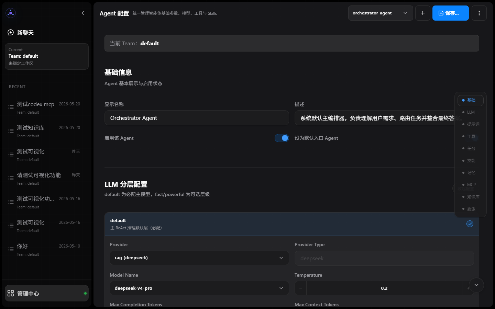
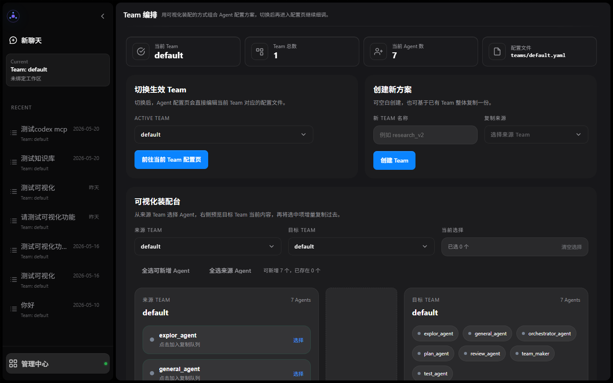
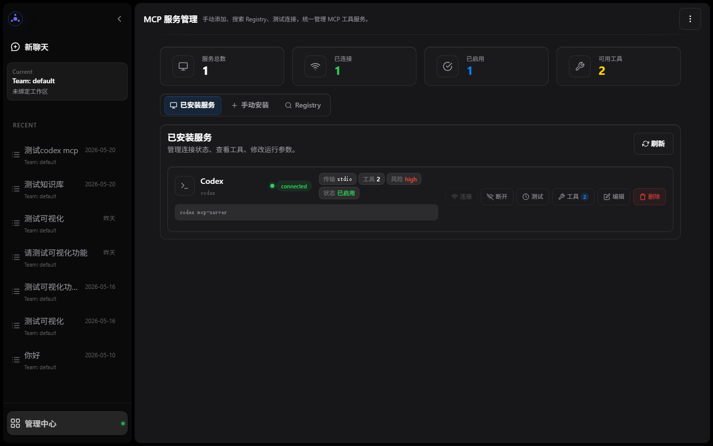
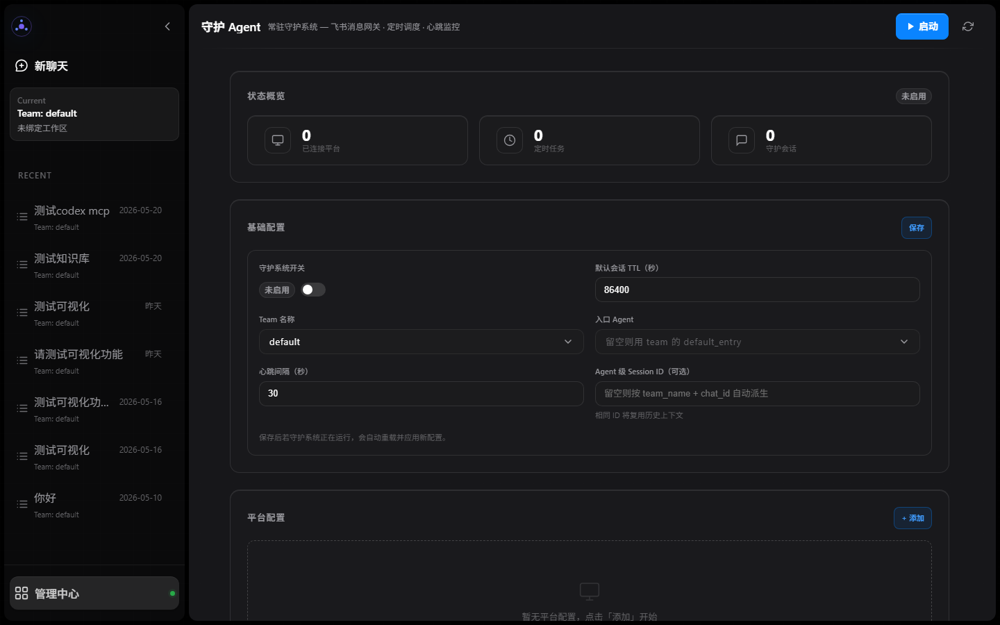

# RAGSystem

中文 | [English](README.en.md)

RAGSystem 是一个面向多智能体协作场景的 Agent-first 全栈项目，主链路由 Fastify/TypeScript 后端与 Vue 3 前端组成。仓库当前聚焦于 ReAct 编排、多 Agent 执行、Skill 化能力收敛、WebSocket 实时交互、Memory 与 Hook 系统、MCP 集成，以及面向运行时目录的配置驱动 Agent 系统。

## 核心能力

- 多智能体编排：基于 Orchestrator Agent 的动态委派、协作与连续执行
- 子 Agent 会话：统一通过 `agent` 工具创建、找回与双向续接
- 实时交互：`POST /api/agent/stream` 启动任务，session WebSocket 推送消息流、执行树、审批、输入和重连回放事件
- 工具与扩展：内置工具运行时、Skills、MCP Server 集成
- 记忆与钩子：支持按需记忆召回、会话记忆写入与 Hook 事件扩展
- 配置化运行：支持 Agent Team、模型提供方、MCP 服务、向量化器与守护 Agent 的运行时配置
- 可视化前端：聊天、执行过程、Team 编排、Agent 配置、MCP 管理、知识库、模型管理、守护 Agent 与系统配置页面

安装 Agent Builder 插件后，每个租户会得到可激活的 `agent-builder` Team。用户可在 TeamBuilder（`/team-builder`）激活它并返回聊天，由专职 Agent 协作完成需求调研、能力分析、架构、评估与调优；管理员再在 TeamBuilder 审查 Draft，并发布或持续更新同名业务 Team。完整流程见 [Agent Builder](docs/AGENT_BUILDER.md)。

## 界面预览

<p align="center">
  
</p>

<p align="center">
  
  
</p>

<p align="center">
  
  
</p>

<p align="center">
  
</p>

截图由前端 smoke 截图工具生成，可通过 `cd frontend-client && npm run screenshot:smoke` 重新生成并检查关键页面。

## 仓库结构

```text
.
├── backend-core/             # 共享路由、服务、领域逻辑与契约
├── backend-local/            # SQLite、filesystem、本地身份与桌面入口
├── backend-saas/             # PostgreSQL、S3、多租户与 SaaS 入口
├── frontend-client/          # Vue 3 前端与执行可视化
├── docs/                     # 仓库正式文档中心
└── .github/                  # GitHub 模板与工作流
```

## 技术栈

- 后端：Fastify, TypeScript, WebSocket, SQLite, MCP
- 前端：Vue 3, Vite, Axios, ECharts, MapLibre GL
- 运行模式：Agent-first 编排、ReAct 风格执行、Skills、Memory、Hooks 与运行时目录配置

## 快速开始

### 1. 环境要求

- Node.js 22.5+
- npm
- Chrome 或 Edge（仅生成截图时需要）

### 2. 环境与运行时配置

先复制环境变量示例。仓库级 npm 命令读取仓库根目录 `.env`：

```bash
cp backend-local/.env.example .env
cp frontend-client/.env.example frontend-client/.env
```

TypeScript 后端从运行时目录读取配置；模型 Provider、MCP Server、向量化器、Agent Team 与守护 Agent 配置可通过前端管理页面写入。

后端插件完全由 `backend-local/backend.plugins.yaml` 或 `backend-saas/backend.plugins.yaml` 声明模块、启停、顺序和初始化参数；第三方插件通常只需安装 npm 包并修改对应 YAML。完整格式和插件模块契约见 [后端插件配置](docs/BACKEND_PLUGIN_CONFIG.md)。

- 默认运行时数据根目录：`~/.ragsystem`
- 若设置 `RAG_DATA_ROOT`，则运行时数据根目录变为 `<RAG_DATA_ROOT>`
- 主要运行时配置文件位于 `<data-root>/config`：
  - `app/config.yaml`
  - `agents/team_index.yaml`
  - `agents/teams/*.yaml`
  - `model_adapter/providers.yaml`
  - `vector_store/vectorizers.yaml`
  - `mcp/mcp_servers.yaml`
  - `daemon/daemon.yaml`

更完整的运行、配置与验证说明见 [docs/OPERATIONS.md](docs/OPERATIONS.md)。

Windows PowerShell 可使用 `Copy-Item` 代替 `cp`。

### 3. 启动后端

```bash
npm run dev:backend-local
```

默认监听 `http://localhost:5002`。可通过 `BACKEND_TS_HOST`、`BACKEND_TS_PORT` 或 `PORT` 调整监听地址；设置 `BACKEND_TS_SOCKET_PATH` 时改为监听 Unix domain socket 或 Windows named pipe，并优先于 TCP 配置。当 `frontend-client/dist` 存在时，后端也会托管前端构建产物。

### 4. 启动前端

```bash
cd frontend-client
npm install
npm run dev
```

默认开发地址为 `http://localhost:5174`，并通过 Vite 代理 `/api` 与 WebSocket 到 `http://localhost:5002`。可在 `frontend-client/.env` 中配置 `VITE_DEV_PORT` 与 `VITE_API_PROXY_TARGET`。

### 5. 使用 Docker 启动

Local 模式使用默认 compose：

```bash
docker compose up --build
```

Hybrid SaaS 测试模式使用独立 compose。启动前在仓库根目录的 `.env` 中配置三个独立随机密钥：

```dotenv
SESSION_JWT_SECRET=replace-with-a-long-random-secret
CONTROL_SECRET_MASTER_KEY=replace-with-a-base64-encoded-32-byte-key
SANDBOX_REMOTE_TOKEN=replace-with-an-independent-long-random-token
```

然后构建并启动：

```bash
docker compose -f docker-compose.saas.yml up --build
```

前端地址为 `http://localhost:8080`，首次访问通过安装向导创建管理员和默认租户。SaaS compose 使用独立的 `ragsystem-saas-data`、`ragsystem-saas-postgres` 和对象存储 volumes，不会读取默认 Local compose 的数据。

该 compose 会同时启动沙箱控制面与执行镜像。Backend 不挂载 Docker Socket；只有沙箱控制面可以创建一次性执行容器。每个 lease 使用独立 named volumes，执行容器默认禁网、只读根文件系统、非 root 用户、移除 capabilities，并限制内存、CPU 与 PID。上传文件会通过租户存储复制到该 lease 的只读输入卷，不会直接挂载宿主机 workspace、upload 等目录。

默认 Docker `runc` 配置适合单机开发与可信/半可信任务的租户文件隔离，但不能视为针对恶意代码的生产级内核隔离。生产环境应将沙箱部署到独立 Linux 节点，安装 gVisor 或 Kata Containers，并通过 `SANDBOX_DOCKER_RUNTIME=runsc`（或相应 Kata runtime）启用；不要将沙箱控制端口暴露到公网。远程部署还必须使用 HTTPS，并移除 `SANDBOX_ALLOW_INSECURE_HTTP`。

停止但保留数据：

```bash
docker compose -f docker-compose.saas.yml down
```

该配置仍是单机 SaaS 开发拓扑，不是完整的多节点高可用部署。尤其是 Docker Socket 控制面、沙箱容量调度、磁盘配额和 gVisor/Kata 节点需要在生产环境单独规划。

### 6. 构建 Windows 安装包

Electron 安装包与浏览器开发使用同一套 TypeScript 后端。构建过程会生成独立 backend bundle，并用 Electron 自身的 Node 运行时验证 `node:sqlite` 与 `sqlite-vec` 后再打包。

先安装桌面壳依赖：

```bash
cd desktop-electron
npm install
```

然后执行安装包构建：

```bash
cd ../desktop-electron
npm run build:installer
```

构建链路会依次：
- 构建 `frontend-client/dist`
- 构建并探测 `backend-local` 的桌面 bundle
- 通过 `electron-builder` 输出 NSIS 安装包到 `desktop-electron/release/`

安装后的桌面端会：
- 使用 Electron Node 模式启动本地 TypeScript 后端
- 使用内置窗口访问 `http://127.0.0.1:5002`
- 将运行时数据写入用户主目录下的 `~/.ragsystem/`
- 以后端进程工作目录固定到该 `~/.ragsystem`，避免安装在 `Program Files` 时向只读安装目录写入运行时文件

## 测试与验证

```bash
npm run check:packages
npm run check:backend
npm run check:frontend
npm run check:widget
```

## 文档导航

- [README.en.md](README.en.md) — 英文版 README
- [docs/README.md](docs/README.md) — 仓库正式文档中心
- [backend-core/README.md](backend-core/README.md) — 共享后端核心
- [frontend-client/docs/README.md](frontend-client/docs/README.md) — 前端文档入口
- [docs/OPERATIONS.md](docs/OPERATIONS.md) — 运行、配置与验证
- [docs/BACKEND_PLUGIN_CONFIG.md](docs/BACKEND_PLUGIN_CONFIG.md) — 后端插件配置与接入契约
- [docs/AGENT_BUILDER.md](docs/AGENT_BUILDER.md) — Agent/Skill Draft、自动校验、发布与持续更新
- [docs/refactor/README.md](docs/refactor/README.md) — 当前演进专题

## 贡献

欢迎提交 Issue 和 Pull Request。开始贡献前，请先阅读 [CONTRIBUTING.md](CONTRIBUTING.md)。

## 许可证

本项目基于 [MIT License](LICENSE) 开源。
