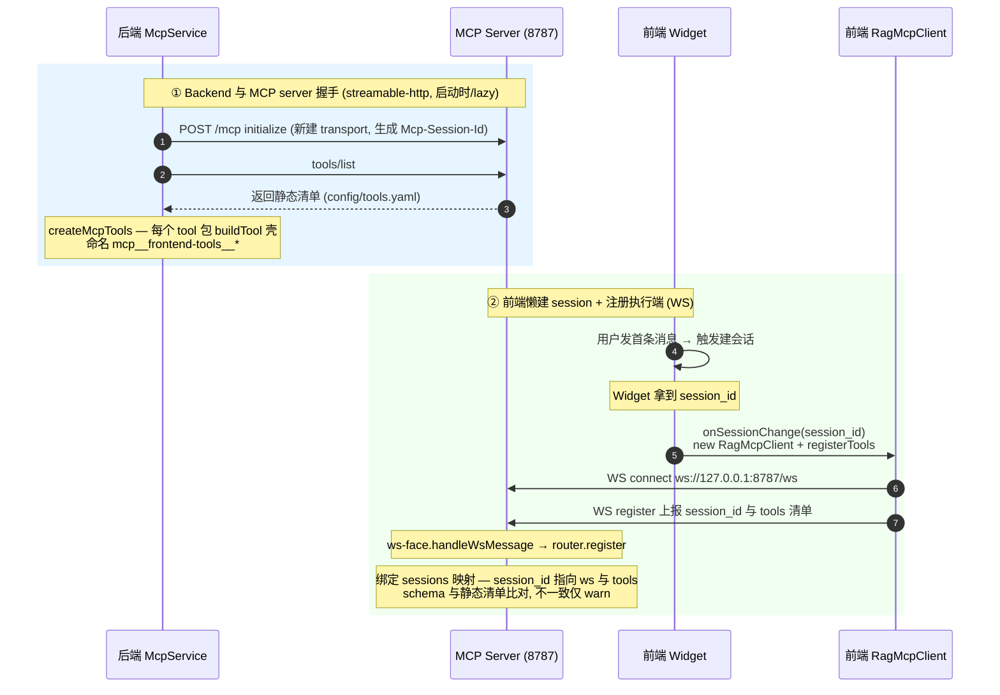
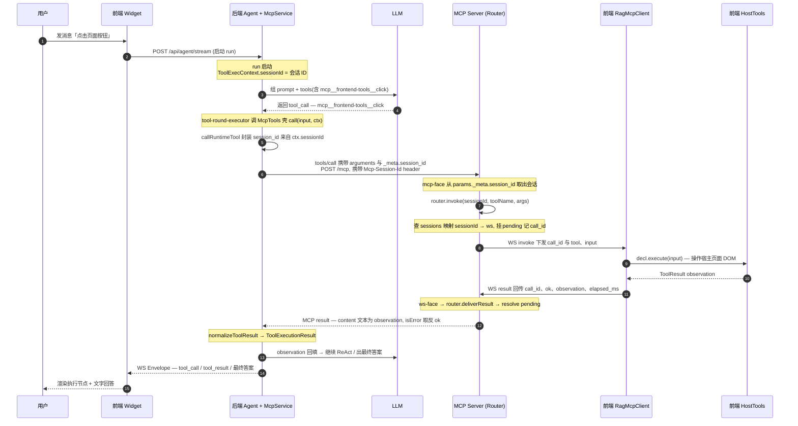
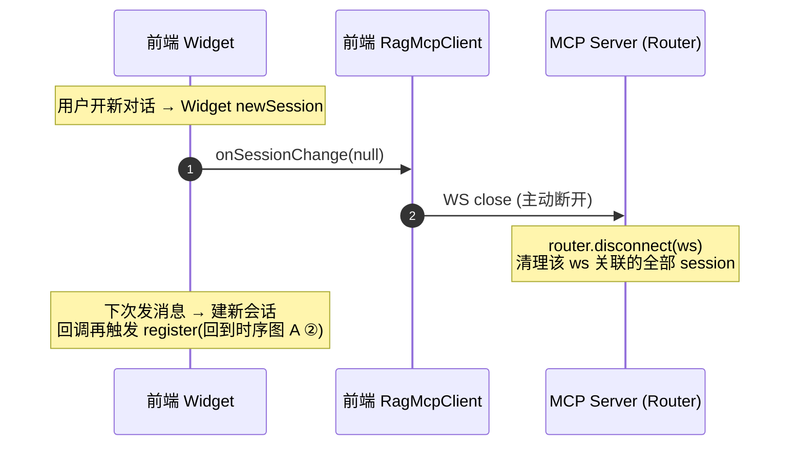
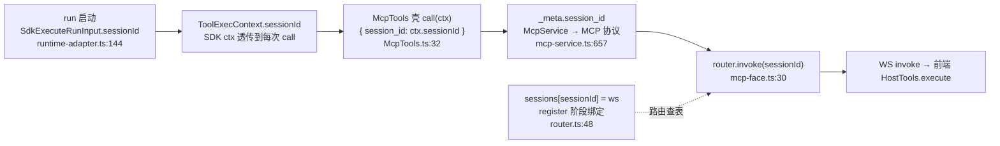

# 前端 / MCP / 后端 完整工作流时序图

> 本文档说明 **host-tool-mcp-server**(前端工具 MCP 桥接中介)在「前端 widget — MCP server — 后端 agent」三方之间的完整工作流。
> 核心问题:**一次 MCP 工具调用,session id 是怎么从后端会话一路带到前端执行端的。**

## 参与者与端口

| 角色 | 产物 / 进程 | 监听面 | 职责 |
| --- | --- | --- | --- |
| **前端 · Widget** | `ragsystem-widget.umd.cjs`(全局 `RagWidget`) | — | 消息入口;懒建 session;`onSessionChange` 把 session_id 回调给页面 |
| **前端 · RagMcpClient** | `ragsystem-mcp-client.umd.cjs`(全局 `RagMcpClient`) | WS client → `/ws` | 执行端;上报工具 register;收 invoke → 执行 → 回 result |
| **前端 · HostTools** | `ragsystem-host-tools.umd.cjs`(全局 `RagHostTools`) | — | DOM / map 工具实现(`execute(input)` 操作宿主页面) |
| **MCP Server** | `host-tool-mcp-server` 独立进程(`:8787`) | `/mcp`(streamable-http,对后端) `/ws`(自定义 WS,对前端) | 路由中介:把 backend 的 `tools/call` 按 `_meta.session_id` 路由到对应前端 WS |
| **后端 · Backend** | `backend-ts`(`:5002`) | REST `/api/agent/stream` WS `/api/agent/ws` | agent 运行 + 标准 MCP client(`McpService`);`McpTools` 把 ctx.sessionId 包成 `_meta` |

> 三方解耦:后端只认**标准 MCP**(把 server 当一个 streamable_http MCP server 接入);server 是纯路由中介;前端只认**自定义 WS** 协议。两两之间无直接耦合。

---

## 时序图 A:启动握手 + 执行端注册

**要点**

- `tools/list` 永远返回 `config/tools.yaml` **静态清单**,不查路由、不随前端连接变化 —— 后端拉一次即可,即便前端此刻没连上,`list` 也正常(只是后续 `call` 会软失败)。
- 注册时机由 **Widget 的 `onSessionChange` 回调**驱动:session_id 就绪 → 建执行端 → register。
- `Mcp-Session-Id`(HTTP header)= transport 会话复用 ID,**不是**业务 session_id;业务 session_id 走 WS register 上报。

---

## 时序图 B:一次工具调用闭环(核心)

以「用户对 widget 说:点击页面按钮」为例,agent 决定调用 `mcp__frontend-tools__click`。

**要点**

- session_id 不进工具 `arguments`(对模型不可见),只走 MCP 规范的 **`_meta`** 字段 —— 这是协议层给「额外元数据」留的口子。
- 后端 → server 是**标准 MCP**(`tools/call`);server → 前端是**自定义 WS**(`invoke`/`result`);server 内部用 `Router` 把两者按 session_id 拼接。
- 缺 session_id / 该 session 无执行端 / schema 不匹配 / 执行超时(60s)→ 均返回**软失败** `ToolResult`(observation 文本),对标 delegate 失败分支,不抛异常打断 run。

---

## 时序图 C:会话切换(newSession)

**要点**:会话与执行端**一一绑定**,切换会话即断开旧执行端、按新 session_id 重新注册,杜绝跨会话串扰。

---

## 附图:session_id 全链路数据流

两条线在 server 端汇合:**注册阶段**建立的 `session_id → 前端 ws` 映射,供**调用阶段**的 `router.invoke` 查表路由。

---

## 关键设计点

1. **session_id 走 `_meta`,不走 arguments / 不走 transport header**
   `arguments` 是给模型看的工具参数,session_id 属运行时元数据,放 `_meta` 既不污染模型输入、又符合 MCP 规范。transport 层的 `Mcp-Session-Id` header 只管连接复用,两者互不干扰。

2. **中介进程承担「协议转换 + 会话路由」**
   后端 ↔ server 是标准 MCP(streamable-http);server ↔ 前端是自定义 WS。server 内部 `Router` 用 `session_id` 作 key,把标准 `tools/call` 路由到正确的浏览器执行端,支持多前端 / 多会话并发隔离。

3. **配置驱动 + 自描述下沉**
   `tools/list` 返回 `config/tools.yaml` 静态清单(后端拉一次);前端 register 时上报运行时声明,server 仅做 schema 漂移告警(不阻断)。工具的「能力声明」与「执行实现」分离:声明静态、执行动态。

4. **与 delegate 路径并存(`mcp__` 前缀隔离)**
   host-tool-mcp-bridge 是「第二条调用路径」,与既有委托模式(delegate_call / delegate_result)并存,通过 `mcp__` 工具名前缀天然隔离,互不影响。
